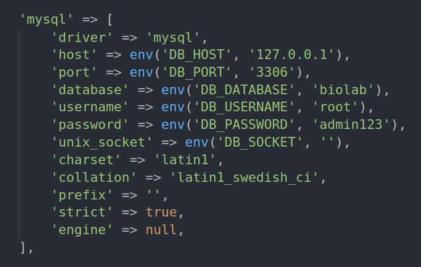

Lab Booking Portal

## About Lab Booking Portal

It is a lab slots booking portal built using [Laravel]() framework and mysql. It has admin and user role privileges. It uses ldap authentication. It also uses fullcalendar schedular, dataTables Javascript libraries and paperboard dashboard. 

# Project Setup
- Clone the repo or download the zip file and exract it.
- Open terminal and go to project folder.
> git clone https://github.com/prabhakarpd7284/lab-booking-portal

> cd ./lab-booking-portal

## Requirements
- php>=7.0
- php{PHP_VERSION}-ldap  //example - php7.2-ldap
> sudo apt-get install php7.2-ldap
- Composer ([Install Composer](https://getcomposer.org/download/))

## Install dependencies
> composer install

> php artisan key:generate

## Database Setup (Mysql)
- Create a new database named **biolab**.
> mysql -u root -e "create database biolab" -p
- Go to project folder.
> cd ~/lab-booking-portal
- Import **"biolab.sql"** file into biolab database in mysql.
> mysql -u root -p biolab < ./biolab.sql
- Open **.env** file and configure database details.
>
- Open **config/database.php** and edit database options in mysql section.
>

## Launch app.
> php artisan serve --port=8000
- Open **http://localhost:8000** in browser.
